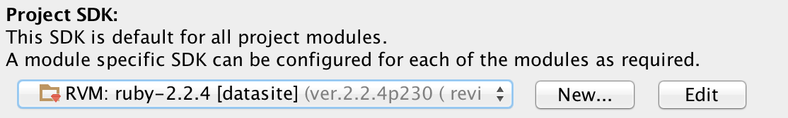

# Core Test Automation Library
Maybe the core functionality/structure could go here, such as managing Saucelabs, etc?

Each app (MA, CM, Jav) could clone this, add their feature files and junk and have at it?

Any changes to core functionality here could be merged to the app repos? Or would we embrace Ruby instead and add these core features to <ruby's equivalent of the standard java artifact repository>

## IntelliJ Configuration

### Install Ruby Plugin

This must be done BEFORE you import the project.

### Project SDK

#### Which version of Ruby?

Current SDK version is stored at: _.ruby-version_

_RVM(nix, mac) users:_ Current gemset for rvm users is at: _.ruby-gemset_

_Check your system:_ in terminal from core dir `which ruby`

#### To Configure in IntelliJ:

File > Project Structure > Project

**Select your SDK that matches in .ruby-version under Project SDK dropdown:**

Project SDK when using RVM with gemset

Not using RVM, find your system ruby version or click New > Ruby SDK and point to system location

=======

## Useful Links:
* [Capybara Cheat Sheat](https://www.launchacademy.com/codecabulary/learn-test-driven-development/rspec/capybara-cheat-sheet)
